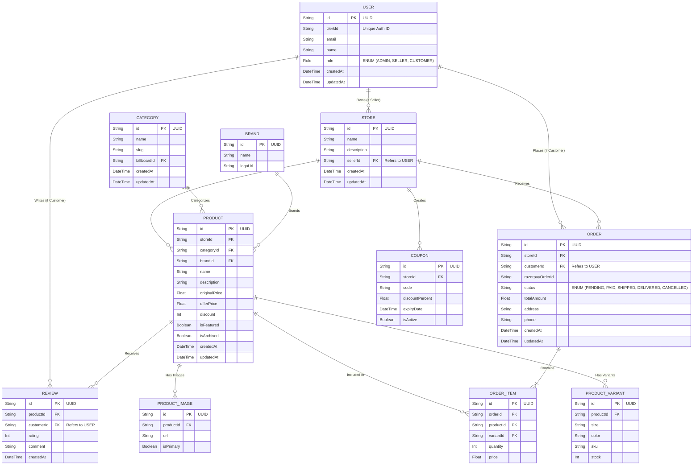

# Database ER Diagram (Phase 4)

Below is the Entity-Relationship (ER) Diagram mapping out our Database Architecture for the Enterprise E-Commerce Platform. This visualizes the `Prisma` schema we will implement in Phase 5.

